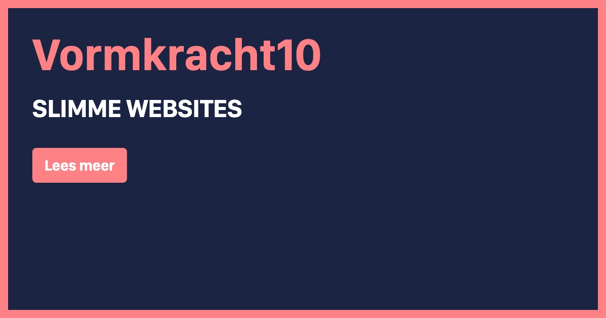

# Generate Dynamic Open Graph Images in Laravel using Blade Views


[](https://github.com/vormkracht10/laravel-og-image/actions/workflows/run-tests.yml)

[](https://packagist.org/packages/vormkracht10/laravel-og-image)
[](https://packagist.org/packages/vormkracht10/laravel-og-image)

This Laravel package enables you to dynamically create Open Graph images for your website based on a single Blade template with HTML and CSS. In our example we use the Tailwind CDN. So designing a dynamic Open Graph Image as a developer just got very easy using this package!

Just add the meta tag with our url to the head of your page. The package will then generate the image and add it to the page. You can edit the view template which you can find in the resources folder.

-   [Requirements](#requirements)
-   [Installation](#installation)
-   [Usage](#usage)
    -   [Passing extra attributes](#passing-extra-attributes)
    -   [Clearing cached images](#clearing-cached-images)
-   [Changelog](#changelog)
-   [Contributing](#contributing)
-   [Security Vulnerabilities](#security-vulnerabilities)
-   [Credits](#credits)
-   [License](#license)

## Requirements

<ul>
  <li>PHP 8.2+</li>
</ul>

## Installation

First install Google Chrome or Chromium, as you need the binary to use it as a headless browser.

### On macOS

```bash
# Google Chrome
brew install --cask google-chrome 
sudo xattr -rd com.apple.quarantine /Applications/Chrome.app # Remove quarantine macOS protection mechanism

# Chromium
brew install chromium
sudo xattr -rd com.apple.quarantine /Applications/Chromium.app # Remove quarantine macOS protection mechanism
```

### On Debian/Ubuntu

```bash
sudo apt update
sudo apt install -y chromium-browser
```

### On Windows

Download and install [Google Chrome](https://google.com/chrome) or [Chromium](https://chromium.woolyss.com/download/) using on of these links.

### Note: configure path to binary

Sometimes it's necessary to point the package to the right path where the binary is, this can be set in the config `og-image.chrome.binary`. The path can be retrieved using:

```bash
# macOS or Debian/Ubuntu
which chrome # probably /Applications/Google\ Chrome.app/Contents/MacOS/Google\ Chrome
which chromium # probably /opt/homebrew/bin/chromium

# Windows
where chrome # probably C:\Program Files\Google\Chrome\Application\chrome.exe
```

## Install and configure package

You can install the package via composer:

```bash
composer require backstage/laravel-og-image
```

Run the command to install the package:

```bash
php artisan og-image:install
```

You should also publish the views, to change the default layout of your Open Graph images:

```bash
php artisan vendor:publish --tag="og-image-views"
```

This is the content of the published config file (published at `config/og-image.php`):

```php
<?php

return [
    'extension' => 'jpg', // jpg, png, webp
    'quality' => 100,
    'width' => 1200,
    'height' => 630,

    'chrome' => [
        'binary' => 'chrome',
        'flags' => [],
    ],

    // The cache location to use.
    'storage' => [
        'disk' => 'public',
        'path' => 'og-images',
    ],

    // Whether to use the browse URL instead of the HTML input.
    // This is slower, but makes fonts available.
    // Alternative: http
    'method' => 'html',

    'metatags' => [
        'og:title' => 'title',
        'og:description' => 'description',
        'og:type' => 'type',
        'og:url' => 'url',
    ],
];
```

## Usage

Add the Blade component into the head of your page. Providing the attributes you need in your view file:

```html
<x-og-image-tags title="Backstage" subtitle="" />
```

If you want to use a different view than the default, add a `view` attribute with the path using dot or slash notation:

```html
<x-og-image-tags title="Backstage" subtitle="" view="path.to.view.file" />
```

If you do not want to use a view but HTML directly in your view file, than you can use the slot to add the HTML to:

> [!NOTE]
> If you're using this option, make sure to clear caches before adding or changing the HTML using `php artisan og-image:clear` to see the result in your browser.

```html
<x-og-image-tags title="Backstage" subtitle="" view="path.to.view.file">
    <h1>Use this HTML and inline CSS to style the open graph image...</h1>
</x-og-image-tags>
```

If you don't want to use the blade component you can also use the facade or helper method to generate the url to the image.

```php
// Facade
use Backstage\OgImage\Laravel\Facades\OgImage;

$url = OgImage::url(['title' => 'Backstage', 'subtitle' => '...']);

// or using the `og()` helper
$url = og(['title' => 'Backstage', 'subtitle' => '...']);
```

And add it like this to your Blade file:

```html
<meta property="og:image" content="{!! $url !!}">
<meta property="og:image:type" content="image/{{ config('og-image.extension') }}">
<meta property="og:image:width" content="{{ config('og-image.width') }}">
<meta property="og:image:height" content="{{ config('og-image.height') }}">
```

When you share the page on any platform, the image will automatically be generated, cached and then shown in your post. The image from the default template will look like this:



This component uses the 'template' blade view by default. You can change this template to your needs. It is even possible to pass more attributes than the default ones. You can find the default template in the resources folder.

### Passing extra attributes

Want to add more custom attributes to modify the button text for example? Simply pass them down to the blade component, facade or helper method:

```html
<x-og-image-tags
    title="Backstage"
    subtitle=""
    button="Read more"
/>
```

```php
// Facade
use Backstage\OgImage\Laravel\Facades\OgImage;

OgImage::url(['title' => 'Slimme websites', 'subtitle' => '...', 'button' => 'Read more']);

// Helper
og(['title' => 'Backstage', 'subtitle' => '...', 'button' => 'Read more']);
```

You can now access the variable in your view by using the `{{ $button }}` variable.

### Generate image without using the blade component

When you need to generate the image without using the blade component, you can use the following method:

```php
OgImage::createImageFromParams(['title' => 'Backstage', 'subtitle' => '...']);
```

This will return the actual image from your configured storage. You can use this method to generate the image in your own controller for example.

### Clearing cached images

All generated open graph images are cached by default. If you want to remove the cache, you can use the following command:

```bash
php artisan og-image:clear-cache
```

## Changelog

Please see [CHANGELOG](CHANGELOG.md) for more information on what has changed recently.

## Contributing

Please see [CONTRIBUTING](https://github.com/backstagephp/.github/blob/main/CONTRIBUTING.md) for details.

## Security Vulnerabilities

Please review [our security policy](../../security/policy) on how to report security vulnerabilities.

## Credits

-   [Bas van Dinther](https://github.com/baspa)
-   [Mark van Eijk](https://github.com/markvaneijk)
-   [All Contributors](../../contributors)

## License

The MIT License (MIT). Please see [License File](LICENSE.md) for more information.
